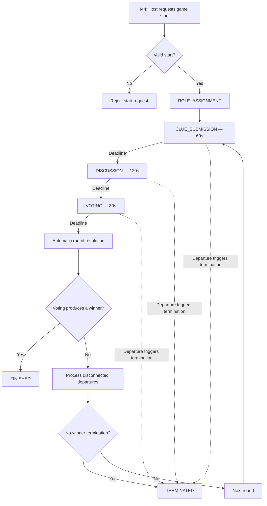

```mermaid
flowchart TD
    A["M4: Host requests game start"] --> B{"Valid start?"}
    B -- No --> X["Reject start request"]
    B -- Yes --> R["ROLE_ASSIGNMENT"]
    R --> C["CLUE_SUBMISSION — 60s"]
    C -- Deadline --> D["DISCUSSION — 120s"]
    D -- Deadline --> V["VOTING — 30s"]
    V -- Deadline --> Q["Automatic round resolution"]
    Q --> W{"Voting produces a winner?"}
    W -- Yes --> F["FINISHED"]
    W -- No --> P["Process disconnected departures"]
    P --> T{"No-winner termination?"}
    T -- Yes --> Z["TERMINATED"]
    T -- No --> N["Next round"]
    N --> C
    C -. "Departure triggers termination" .-> Z
    D -. "Departure triggers termination" .-> Z
    V -. "Departure triggers termination" .-> Z
```
